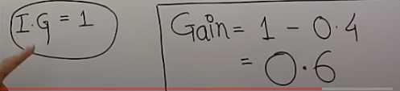

## Linear Regression

**Description:** Linear regression is a simple algorithm used for regression tasks. It models the relationship between a dependent variable and one or more independent variables by fitting a linear equation to observed data.

## Logistic Regression

**Description:** Logistic regression is used for classification tasks. Despite its name, it's a linear model for binary classification that predicts the probability of occurrence of an event by fitting data to a logistic curve.

## Decision Trees

**Description:** Decision trees are versatile algorithms used for both classification and regression tasks. They partition the feature space into a tree-like structure based on feature values, allowing for simple decision-making.

## Random Forests

**Description:** Random forests are an ensemble learning method that builds multiple decision trees and combines their predictions to improve accuracy and reduce overfitting.

## Support Vector Machines (SVM)

**Description:** SVM is a powerful supervised learning algorithm used for classification and regression tasks. It finds the hyperplane that best separates data into different classes while maximizing the margin between classes.

## Naive Bayes

**Description:** Naive Bayes is a simple yet powerful probabilistic classifier based on Bayes' theorem with an assumption of independence between features. Despite its simplicity, it's often effective for text classification and other tasks.

**How it works:** Given a set of features, Naive Bayes calculates the probability of each class label based on the feature values. It assumes that all features are conditionally independent, which means that the presence of one feature does not affect the presence of another.

**Application:** Naive Bayes is commonly used in text classification tasks such as spam detection, sentiment analysis, and document categorization. It's also used in medical diagnosis, email filtering, and recommendation systems.

## K-Nearest Neighbors (KNN)

**Description:** K-Nearest Neighbors (KNN) is a simple and intuitive algorithm used for both classification and regression tasks. It works by finding the K nearest data points to a given query point and making predictions based on the majority class (for classification) or the average value (for regression) of those neighbors.

**How it works:** To make predictions, KNN calculates the distance between the query point and all other data points in the dataset (usually using Euclidean distance). It then selects the K nearest neighbors and assigns the query point to the majority class (for classification) or averages their values (for regression).

**Application:** KNN is commonly used in recommendation systems, anomaly detection, and pattern recognition. It's also used in medical diagnosis, handwriting recognition, and image classification. However, it can be computationally expensive, especially with large datasets, and requires careful selection of the value of K and appropriate feature scaling.

## Neural Networks

**Description:** Neural networks are a class of models inspired by the structure and function of the human brain. They consist of interconnected nodes (neurons) organized in layers and are capable of learning complex patterns and relationships from data.

## K-means Clustering

**Description:** K-means is a popular unsupervised learning algorithm used for clustering tasks. It partitions data into K clusters by iteratively assigning data points to the nearest centroid and updating the centroids based on the mean of points assigned to each cluster.

## Principal Component Analysis (PCA)

**Description:** PCA is a dimensionality reduction technique used to reduce the number of features in a dataset while preserving most of its variance. It identifies the orthogonal axes (principal components) that capture the maximum variance in the data.

## Q-Learning

**Description:** Q-learning is a model-free reinforcement learning algorithm used to learn optimal policies for sequential decision-making tasks. It learns by estimating the value of taking specific actions in particular states and updating these estimates based on rewards received.

## Deep Q-Networks (DQN)

**Description:** DQN is a deep learning-based reinforcement learning algorithm used to approximate Q-learning in environments with high-dimensional state spaces. It uses neural networks to estimate Q-values and learns directly from raw sensory inputs.

# Question & Answer

### Q1. How to handle imbalance data?
Handling imbalanced data is crucial for building robust machine learning models, especially in classification tasks where one class significantly outnumbers the others. Here are some techniques to address imbalanced data:

1. **Resampling**:

    1. **Oversampling:** Increase the number of minority class samples by duplicating them or generating synthetic samples (e.g., SMOTE - Synthetic Minority Over-sampling Technique).
    1. **Undersampling:** Decrease the number of majority class samples by randomly removing instances or using more sophisticated techniques like Tomek links or NearMiss.
2. **Weighted Loss Function**: 

    * Assign different weights to classes in the loss function to penalize misclassifications of the minority class more heavily. This way, the model pays more attention to the minority class during training.

3. **Ensemble Methods:**
    - Use ensemble techniques like Bagging (Bootstrap Aggregating) or Boosting (e.g., AdaBoost, XGBoost) with resampling techniques to create diverse models that are robust to imbalanced data.
    - Specifically, some boosting algorithms have built-in mechanisms to handle class imbalance.

4. **Different Algorithms:**

    * Some algorithms inherently handle imbalanced data better than others. For example, decision trees and their ensemble variants (e.g., Random Forests) can perform well with imbalanced data.
    * Support Vector Machines (SVMs) with appropriate class weights or non-linear kernels can also handle imbalanced data effectively.
5. **Cost-sensitive Learning:**

    * Adjust the misclassification costs for different classes to reflect the imbalance in the data. Some algorithms allow for customizing misclassification costs.

6. **Generate Synthetic Data:**

    * Use data generation techniques to create synthetic samples for the minority class, such as generative adversarial networks (GANs).

7. **nomaly Detection:**

    * Treat the problem as an anomaly detection task, where the minority class is considered the anomaly, and use algorithms tailored for anomaly detection.

### Q2. What is bagging and boosting?
Bagging (Bootstrap Aggregating) and boosting are both ensemble learning techniques used to improve the performance of machine learning models by combining the predictions of multiple base models.

1. **Bagging**: Bagging involves training multiple instances of the same base learning algorithm on different subsets of the training data. These subsets are sampled with replacement (bootstrap samples). Then, predictions from each model are combined, often by averaging (for regression) or voting (for classification), to produce the final prediction. The idea is to reduce variance and prevent overfitting by averaging out the predictions from different models.

1. **Boosting**: Boosting, on the other hand, focuses on sequentially training multiple weak learners (models that are only slightly better than random guessing) and combining their predictions. In boosting, each model tries to correct the errors made by the previous ones. Common boosting algorithms include AdaBoost, Gradient Boosting Machine (GBM), and XGBoost. Boosting aims to reduce bias and improve the overall predictive power of the model.

Both bagging and boosting are powerful techniques for improving the performance of machine learning models and are widely used in practice.

### Q3. What is activation function 
An activation function is a mathematical function applied to the output of each neuron in a neural network. It helps determine whether the neuron should be activated or not, by introducing non-linearity to the network. This non-linearity is crucial for enabling the neural network to learn complex patterns in data. Common activation functions include sigmoid, tanh, ReLU, and softmax. Each has its own characteristics and is suitable for different types of problems.

### Q4. What is transfer learning?
Transfer learning is a machine learning technique where a model trained on one task is repurposed or adapted for another related task. Instead of starting the learning process from scratch, the model leverages knowledge gained from the original task to improve performance on the new task, often with less labeled data and training time.

### Q5. What is z-score?
A z-score, also known as a standard score, measures the number of standard deviations a data point is from the mean of a dataset. It's calculated by subtracting the mean from the data point and then dividing by the standard deviation. Z-scores are useful for comparing data points from different distributions, as they provide a standardized measure of how far a data point is from the mean.

### Q6. What is autoencoder?
An autoencoder is a type of artificial neural network used for unsupervised learning. It learns to encode input data into a lower-dimensional representation and then decode it back to its original form. The network consists of an encoder, which compresses the input data into a latent representation, and a decoder, which reconstructs the original data from the latent representation. Autoencoders are often used for tasks like dimensionality reduction, feature learning, and data denoising.

### Q7. Decision Tree?  
`Ans` - 
    
* A decision tree is a type of supervised learning algorithm that is commonly used in machine learning to model and predict outcomes based on input data. 
* The decision tree algorithm falls under the category of supervised learning. They can be used to solve both regression and classification problems.

    ### How Decision Tree is formed?
    * The process of forming a decision tree involves `recursively partitioning the data` based on the values of different attributes. 
    * The algorithm selects the `best attribute to split the data at each internal node`, based on certain criteria such as information gain or Gini impurity. 
    * This `splitting process continues until a stopping criterion is met`, such as reaching a maximum depth or having a minimum number of instances in a leaf node.

    ### major challenge
    In the Decision Tree, the major challenge is the identification of the attribute for the root node at each level. This process is known as attribute selection. 
    We have two popular attribute selection measures:
    1. Information Gain
    2. **Gini Index**: The Gini Index is a measure of the inequality or impurity of a distribution, commonly used in decision trees and other machine learning algorithms. It ranges from 0 to 0.5, where 0 indicates a pure set (all instances belong to the same class), and 0.5 indicates a maximally impure set (instances are evenly distributed across classes).

    ### What are the steps to Create a Decision Tree?

    

    **Step 1: Selection of Target attributes**  
    Given a dataset find out the target attributes.Here, i choose *profit* as target attributes. 

    **Step 2: Find out information gain of target attributes**  
    Here, we are find the information gain for the *profit* attributes
    
    

    **Step 3: Calculate the entropy of reamining attributes**  
     
    * We are finding entropy of each reamining attributes because we need to find one attributes which become our root node.
    * Entorpy of that entropy is equal to multiplication of information gain of that attributes x probability of that attributes.
    

    **Step4: Find out gain of all the attributes**  
    
    - difference of information gain of target attributes - entropy of given attributes.
    - those attributes which has highest gain become our root node of decision tree.
    

   